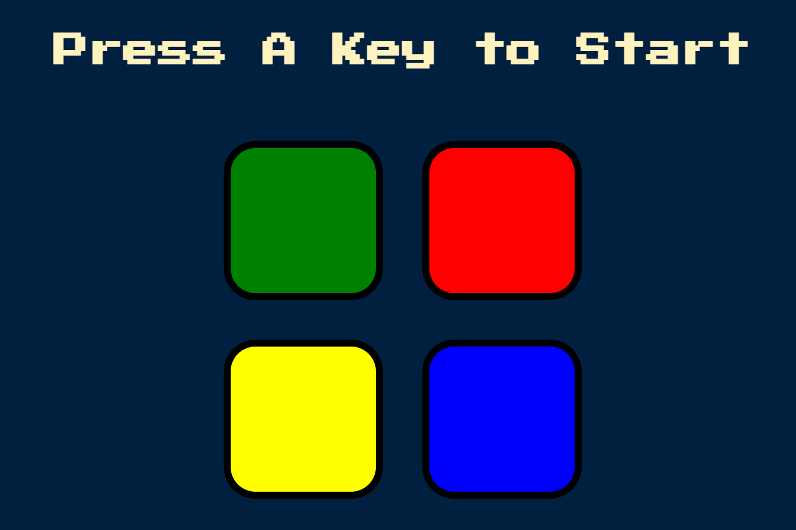

# 🎵 Simon Game

A classic memory game built with HTML, CSS, and JavaScript.  
Press any key to start, follow the color pattern, and challenge your memory!

---

## ✨ Features
- Generates random color sequences each round
- Plays unique sounds and highlights buttons as hints
- Tracks your current level and shows "Game Over" on mistake
- Smooth animations and responsive design
- Simple and fun to play right in your browser

---

## 🚀 How to Play
1. Open the game in your browser
2. Press any key to start
3. Watch the sequence of colors and sounds carefully
4. Click the buttons in the **same order**
5. Each round adds a new color to the sequence
6. Keep playing and see how many levels you can clear!

---

## 🛠 Built With
- HTML5
- CSS3
- JavaScript
- jQuery

---
